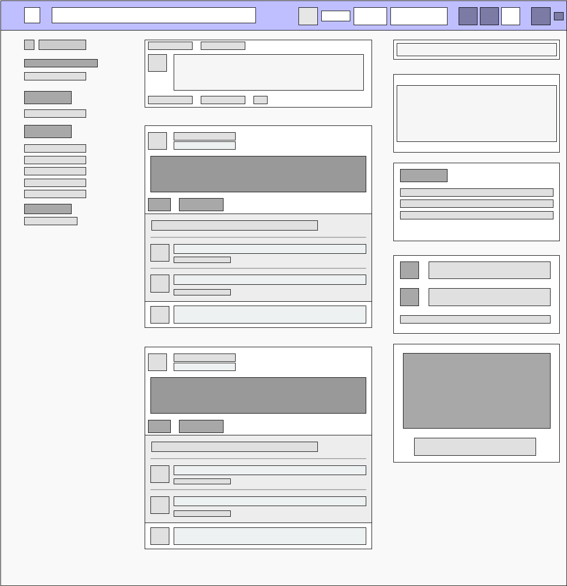
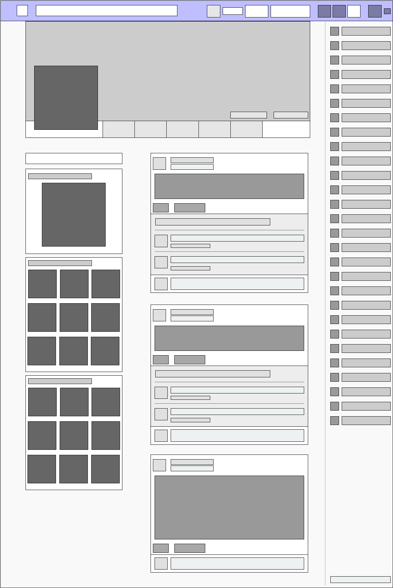
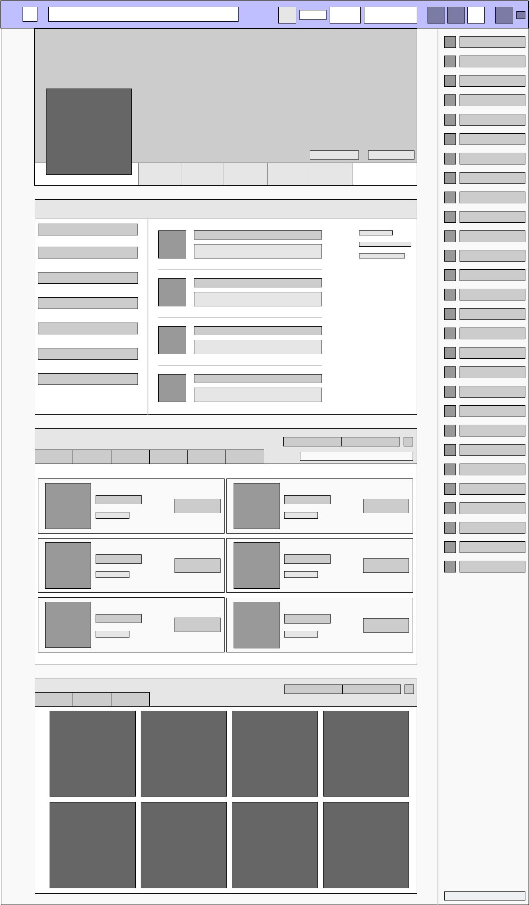
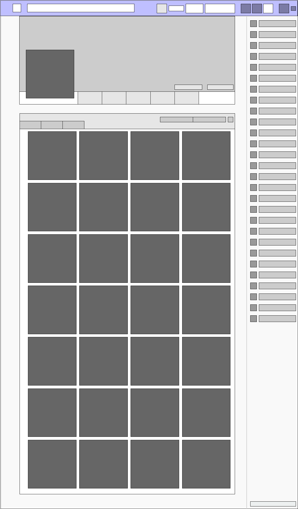

# Facebook Design Teardown

[Home Page](#home-page)

[News Feed Page](#news-feed-page)

[Profile Page](#profile-page)

[About Page](#about-page)

[Photos Page](#photos-page)

---

## Home Page
### 1. Visual hierarchy - What areas are denser and what areas are more sparse?

The right half of the page is more dense than the left.

### 2. Who is the most likely user of this page?

Anyone who is visiting the site for the first time or is not currently logged in.

### 3. What is that user's critical goal on this page?

The main goal is to sign up for an account, though the user may also login with an existing account in the top right of the page.

### 4. Does the visual hierarchy you sketched lead to that goal?

Yes, it is obvious that the page wants the user to sign up for an account.

### 5. Do the relationships between elements lead you to that goal?

_Contrast_

> The CTA (Signing Up) takes up a large part of the screen and is the most dense of the two columns. The large green "Create Account" button at the bottom also draws attention as to the purpose of the page. Meanwhile the "Login" button seems to blend into the top bar so that only repeat users will immediatley notice it.

_Repetition_

> The sign up form feels consistent in the style and use of font family.

_Alignment_

> The entire right column contains everything left-aligned that is needed to create a new account. It makes it feel like a seamless flow.

_Proximity_

> The spacing and alignment of items give the sense of separation of items without visible divider sections.

### 6. What font families are most prominent on the page?

Most everything is Helvetica except for the header text which is Freight Sans.

### 7. What do these font families contribute to or take away from the site's flow?

While the Helvetica font makes use of the "professional" and appearance, the Freight Sans makes the headers and sub-headers stand out more. This does not appear to take away from the site's flow at all.

### 8. How do the line spacings, sizes and weights contribute to or take away from the site's flow?

The spacing and sizes look fine and do not detract from the flow.

### 9. What would you improve to achieve a better hierarchy or flow?

I would maybe add something additional to the lower left column to help balance the page.

---

## News Feed Page
### 1. Visual hierarchy - What areas are denser and what areas are more sparse?

The left and right columns aren't as dense as the center.

### 2. Who is the most likely user of this page?

Anyone who logs into Facebook will see this page first.

### 3. What is that user's critical goal on this page?

The goal would be to view friend's recent activities.

### 4. Does the visual hierarchy you sketched lead to that goal?

Yes. Upon reaching this page the content is immeidatley available in the center column.

### 5. Do the relationships between elements lead you to that goal?

_Contrast_

> The navbar items, in particular the icons to the right, are a darker blue when there is nothing of note. However, in the case of a notification for instance, the icon turns white bringing attention to itself. Friend's posts have darker and bolder content drawing the user's eye to the center as well.

_Repetition_

> There is a "card" like structure to the center and right columns. It gives a quick appearance of consistency even though each piece is fundamentally different.

_Alignment_

> The page is divided up into three columns. The left column is the smallest and provides additional navigation. The center is the largest and contains the content the user looks for primarily. The right column contains ads or other links the user may find interesting.

_Proximity_

> There is a good spacing between items. Within the "cards" there is enough spacing to let the content of the post be the center of attention while not over-doing it.

### 6. What font families are most prominent on the page?

Helvetica is the primary font family.

### 7. What do these font families contribute to or take away from the site's flow?

The use of a single font family makes it a very uniform feel across the entire page. Making use of bold or different colors in the font provide an effective way of splitting up content.

### 8. How do the line spacings, sizes and weights contribute to or take away from the site's flow?

Line spacing feels a little tight on the left and right columns.

### 9. What would you improve to achieve a better hierarchy or flow?

There is a "Create" section on the left navigation area that doesn't quite seem to fit the styling of the other links on that side of the page. It is just a row of text links, with "Fundraiser" being text-wrapped to the next line.

---

## Profile Page
### 1. Visual hierarchy - What areas are denser and what areas are more sparse?

The left 2/3 of the page is more dense than the far right ribbon which lists when friends were last online.

### 2. Who is the most likely user of this page?

Someone looking to connect with or gather more information on the person's profile in question.

### 3. What is that user's critical goal on this page?

Gather information based on the user's profile.

### 4. Does the visual hierarchy you sketched lead to that goal?

Yes, there are quick links near the top to view recent activity, get information about the user, look at their friends and also view their photos.

### 5. Do the relationships between elements lead you to that goal?

_Contrast_

> The first and foremost attention-getter is the user's banner image and profile avatar. The links below this are easy to notice and stand out enough to assist in the primary goal.

_Repetition_

> Similar to the News Feed page, there are repeating "cards" that make up the bulk of the design.

_Alignment_

> The left-most column is dedicated to specific information regarding the user's profile. The center has post feeds, and the far right column is small enough to be unobtrusive.

_Proximity_

> There is good spacing between all items to provide readability and flow.

### 6. What font families are most prominent on the page?

Helvetica is once again the prominent font family.

### 7. What do these font families contribute to or take away from the site's flow?

Keeping with the Helvetica theme maintains the sense of consistency throughout the pages.

### 8. How do the line spacings, sizes and weights contribute to or take away from the site's flow?

The spacing does a good job at differentiating between segments of content on the page.

### 9. What would you improve to achieve a better hierarchy or flow?

At first I thought there was too much space between the center column and the far right online status field, but it actually does a good job of keeping that content out of sight unless the user is looking for it.

---

## About Page
### 1. Visual hierarchy - What areas are denser and what areas are more sparse?

The left 3/4 of the page is a lot more dense than the right.

### 2. Who is the most likely user of this page?

Someone looking to get more information about a particular user.

### 3. What is that user's critical goal on this page?

Get information such as where the person went to school or where they work.

### 4. Does the visual hierarchy you sketched lead to that goal?

Yes, the first card contains easy to access information for this purpose.

### 5. Do the relationships between elements lead you to that goal?

_Contrast_

> The navigaiton within the About card contains light gray text when out of focus and darker text when selected. This makes it easy to see which information the user is looking at.

_Repetition_

> Wide cards take up the bulk of the page and each one is similar in structure.

_Alignment_

> The left 2/3 of the page make up the primary content while the far right shows current online friends.

_Proximity_

> Good spacing on the About card made it easy to get information fast.

### 6. What font families are most prominent on the page?

Helvetica is still used as on other pages.

### 7. What do these font families contribute to or take away from the site's flow?

Consistent design throughout all pages.

### 8. How do the line spacings, sizes and weights contribute to or take away from the site's flow?

Spacing is good. I think the larger cards make good use of space on the page.

### 9. What would you improve to achieve a better hierarchy or flow?

Flow is good, nothing I could think of improving.

---

## Photos Page
### 1. Visual hierarchy - What areas are denser and what areas are more sparse?

The left 2/3 of the page is extremely heavy.

### 2. Who is the most likely user of this page?

A user wanting to view photos/videos of another person.

### 3. What is that user's critical goal on this page?

Look at another user's photos.

### 4. Does the visual hierarchy you sketched lead to that goal?

Yes, the primary card on this page is a long scrolling list of photo thumbnails.

### 5. Do the relationships between elements lead you to that goal?

_Contrast_

> The actual links for creating new albums or uploading photos blends in nicely with the background of the card, indicating that the primary goal is not necessarily to add images from here.

_Repetition_

> Each image thumbnail is identical in size and shape.

_Alignment_

> The list of image thumbnails are all equal in size so the alignment is more justified without excessive margins.

_Proximity_

> There is a small amount of padding between each thumbnail.

### 6. What font families are most prominent on the page?

Helvetica as other pages are.

### 7. What do these font families contribute to or take away from the site's flow?

Consistent Helvetica font family throughout the pages make the experience feel familiar.

### 8. How do the line spacings, sizes and weights contribute to or take away from the site's flow?

The thumbnail sizes are a nice size and do a good job of keeping people's faces in the crop.

### 9. What would you improve to achieve a better hierarchy or flow?

Nothing, I think the design is very nice!
