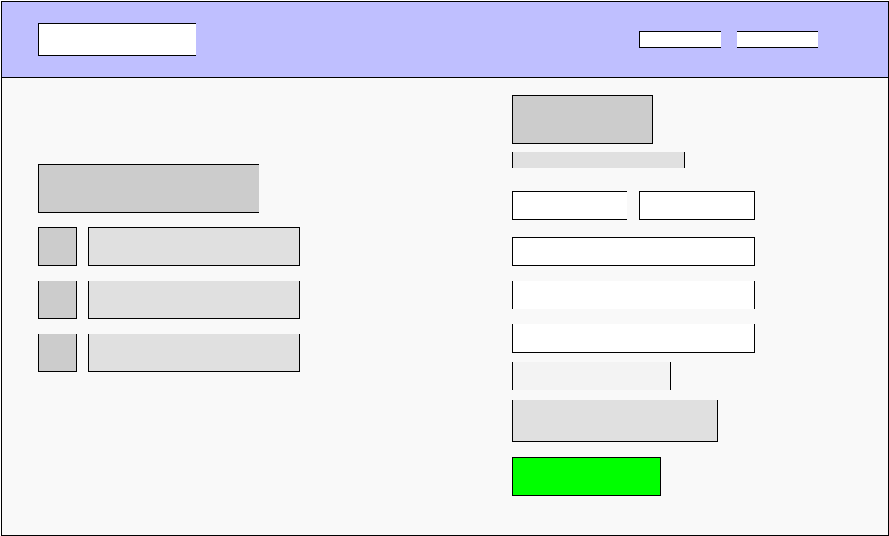

# Facebook Design Teardown

[Home Page](#home-page)
[News Feed Page](#news-feed-page)
[Profile Page](#profile-page)
[About Page](#about-page)
[Photos Page](#photos-page)

---

## Home Page
### 1. Visual hierarchy - What areas are denser and what areas are more sparse?

The right half of the page is more dense than the left.

### 2. Who is the most likely user of this page?

Anyone who is visiting the site for the first time or is not currently logged in.

### 3. What is that user's critical goal on this page?

The main goal is to sign up for an account, though the user may also login with an existing account in the top right of the page.

### 4. Does the visual hierarchy you sketched lead to that goal?

Yes, it is obvious that the page wants the user to sign up for an account.

### 5. Do the relationships between elements lead you to that goal?

_Contrast_

> The CTA (Signing Up) takes up a large part of the screen and is the most dense of the two columns. The large green "Create Account" button at the bottom also draws attention as to the purpose of the page. Meanwhile the "Login" button seems to blend into the top bar so that only repeat users will immediatley notice it.

_Repetition_

> The sign up form feels consistent in the style and use of font family.

_Alignment_

> The entire right column contains everything left-aligned that is needed to create a new account. It makes it feel like a seamless flow.

_Proximity_

> The spacing and alignment of items give the sense of separation of items without visible divider sections.

### 6. What font families are most prominent on the page?

Most everything is Helvetica except for the header text which is Freight Sans.

### 7. What do these font families contribute to or take away from the site's flow?

While the Helvetica font makes use of the "professional" and appearance, the Freight Sans makes the headers and sub-headers stand out more. This does not appear to take away from the site's flow at all.

### 8. How do the line spacings, sizes and weights contribute to or take away from the site's flow?

The spacing and sizes look fine and do not detract from the flow.

### 9. What would you improve to achieve a better hierarchy or flow?

I would maybe add something additional to the lower left column to help balance the page.

---

## News Feed Page
### 1. Visual hierarchy - What areas are denser and what areas are more sparse?

### 2. Who is the most likely user of this page?

### 3. What is that user's critical goal on this page?

### 4. Does the visual hierarchy you sketched lead to that goal?

### 5. Do the relationships between elements lead you to that goal?

_Contrast_

>

_Repetition_

>

_Alignment_

>

_Proximity_

>

### 6. What font families are most prominent on the page?

### 7. What do these font families contribute to or take away from the site's flow?

### 8. How do the line spacings, sizes and weights contribute to or take away from the site's flow?

### 9. What would you improve to achieve a better hierarchy or flow?

---

## Profile Page
### 1. Visual hierarchy - What areas are denser and what areas are more sparse?

### 2. Who is the most likely user of this page?

### 3. What is that user's critical goal on this page?

### 4. Does the visual hierarchy you sketched lead to that goal?

### 5. Do the relationships between elements lead you to that goal?

_Contrast_

>

_Repetition_

>

_Alignment_

>

_Proximity_

>

### 6. What font families are most prominent on the page?

### 7. What do these font families contribute to or take away from the site's flow?

### 8. How do the line spacings, sizes and weights contribute to or take away from the site's flow?

### 9. What would you improve to achieve a better hierarchy or flow?

---

## About Page
### 1. Visual hierarchy - What areas are denser and what areas are more sparse?

### 2. Who is the most likely user of this page?

### 3. What is that user's critical goal on this page?

### 4. Does the visual hierarchy you sketched lead to that goal?

### 5. Do the relationships between elements lead you to that goal?

_Contrast_

>

_Repetition_

>

_Alignment_

>

_Proximity_

>

### 6. What font families are most prominent on the page?

### 7. What do these font families contribute to or take away from the site's flow?

### 8. How do the line spacings, sizes and weights contribute to or take away from the site's flow?

### 9. What would you improve to achieve a better hierarchy or flow?

---

## Photos Page
### 1. Visual hierarchy - What areas are denser and what areas are more sparse?

### 2. Who is the most likely user of this page?

### 3. What is that user's critical goal on this page?

### 4. Does the visual hierarchy you sketched lead to that goal?

### 5. Do the relationships between elements lead you to that goal?

_Contrast_

>

_Repetition_

>

_Alignment_

>

_Proximity_

>

### 6. What font families are most prominent on the page?

### 7. What do these font families contribute to or take away from the site's flow?

### 8. How do the line spacings, sizes and weights contribute to or take away from the site's flow?

### 9. What would you improve to achieve a better hierarchy or flow?

---
