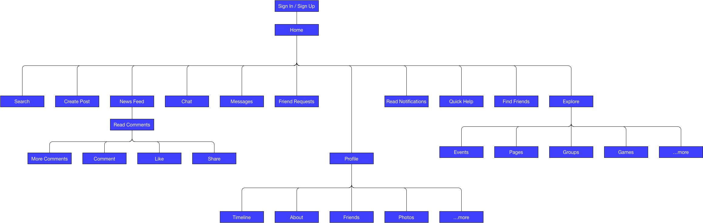
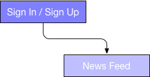

# Facebook UX Teardown

### 1. Who is the main user of Facebook?

The key user is someone looking to be involved in social media and connecting with others. The target demographic is most likely someone in their 20's or teens.

### 2. What are the top 3 critical goals for that user?

1. Read recent activity from friends
2. Create posts to share with others
3. Find friends and make connections

### 3. What is the site's approximate information architecture?


```
|-- Sign Up / Sign In
    |-- Home
        |-- Search
        |-- Create Post
        |-- News Feed
            |-- Read Comments
            |-- More Comments
            |-- Comment
            |-- Like
            |-- Share
        |-- Chat
        |-- Messages
        |-- Friend Requests
        |-- Profile
            |-- Timeline
            |-- About
            |-- Friends
            |-- Photos
            |-- ...more
        |-- Read Notifications
        |-- Find Friends
        |-- Explore
            |-- Events
            |-- Pages
            |-- Groups
            |-- Games
            |-- ...more
        |-- Quick Help
```

### 4. For your top user goal, what is likely to make the user's experience particularly satisfying?

The primary goal of consuming recent activity from friends is immediately available upon login, with no additional clicks necessary.

### 5. To accomplish this goal, how does the user flow through the site's architecture? (ie. which pages are visited and what are clicked?)



### 6. What style(s) of navigation is/are used? Do they answer the key questions (Where am I and how did I get here? Where should I go next and how do I get there?)?

A top navigation bar is used across all pages providing consistency and making it easy for the user to know where to go next. The navbar provides the Facebook logo linking back to the Home page, a search bar, link to the user's profile, another Home button link explicitly spelled out as 'Home', a 'Find Friends' button, as well as several other icon based buttons: Friends, Messages, Notifications and Quick Help.

There is no visual indication on the navbar to show what page the user is currently on, though the 'cards' present on the page do a decent job of providing this information.

### 7. What does Facebook do well to allow the user to accomplish the top goal effectively, efficiently and with good satisfaction?

The News Feed is the first and foremost prominent bit of content made available upon loging in. This makes it extremely quick and easy for the user to jump right in and begin reading.

### 8. What does Facebook do poorly when allowing the user to accomplish the top goal effectively, efficiently and with good satisfaction?

Advertisements can cause distractions, particular between the right-most column and the Suggested Posts that appear in the News Feed.
